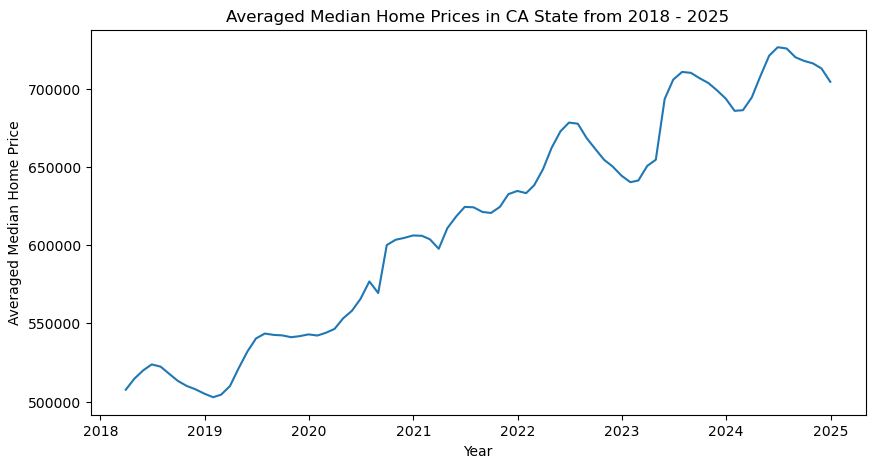
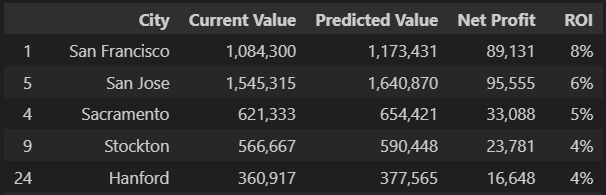
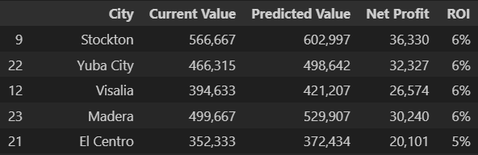
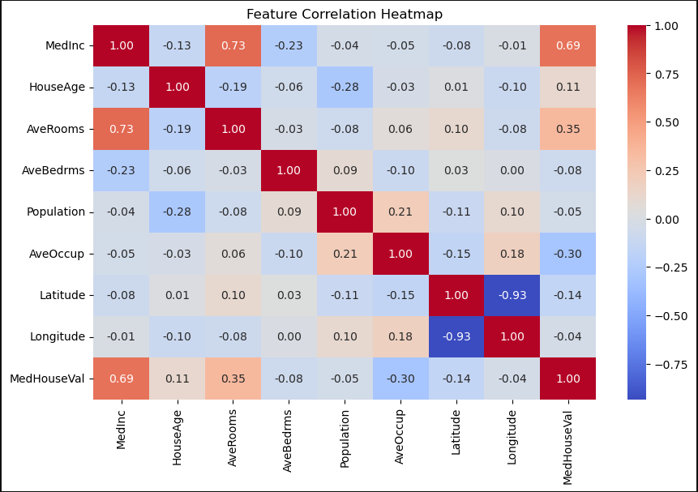
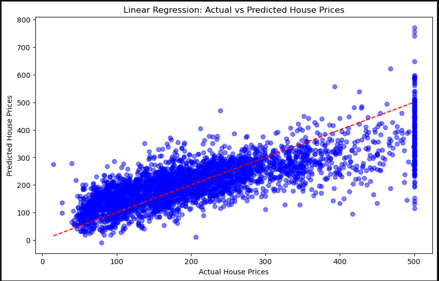
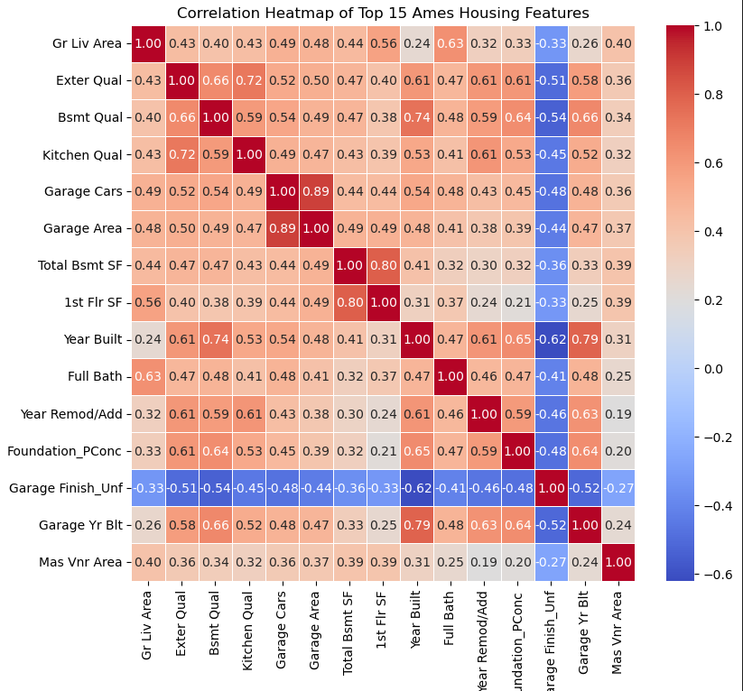
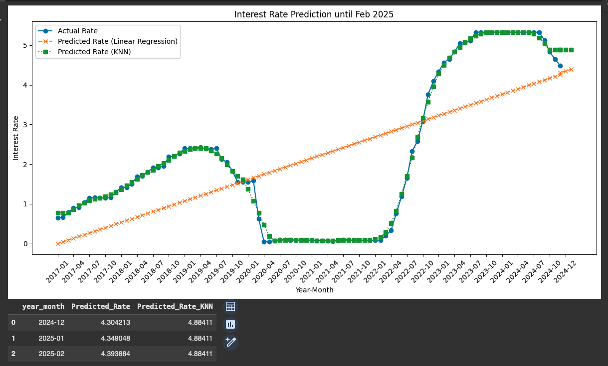
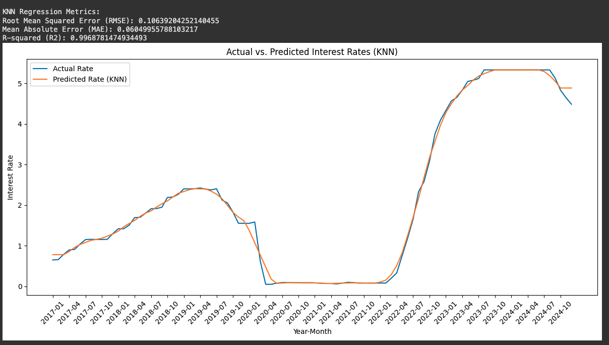

# **Golden State Housing Insights: A predictive analysis of California's housing market**
<a id="idtop"></a>  


## Table of Contents
* [Project Overview](#overview)
* [Business Scenario](#business-scenario)
* [Data PreProcessing](#data-preprocessing)
* [Model Training and Testing](#model-training-and-testing)
* [Visuals and Explanations](#visuals-and-explanations)
* [Demos and Slideshow](#demos-and-slideshow)
* [Final Summary](#final-summary)
* [Recommendations and Conclusion](#recommendations-and-conclusion)
* [Project Contributors](#project-contributors) 
* [Project Structure](#project-structure)
* [Repository Links](#repository-links)
* [References](#references)

## Project Overview 
The primary goal of our project, Golden State Housing Insights, is to predict housing prices in the state of California. Our team aims to achieve this by leveraging machine learning models to analyze various factors, including investor return on investment (ROI), feature analysis and interest rate predictability. By integrating these elements, we strive to provide accurate and actionable insights into the California housing market, aiding investors, homebuyers, and policymakers in making informed decisions.

The business question we hope to answer is: *What are the key interrelationships between housing price as dictated by home features and interest rates as well as housing price for california metro area returns over time?*

Our motivation for taking on this challenge is to find out if we can accurately predict housing prices based off home features, interest rates and metro areas.

[🔼 Back to top](#idtop)
<hr>

## Business Scenario
We approached our business problem as independent real estate consultants. Our client, who recently accepted a job offer in California, seeks to purchase a home in the area. They have tasked us with identifying the top 5 metro areas with the highest return on investment (ROI) based on a home feature analysis. Additionally, we will predict near-term interest rates using Time Series modeling and linear regression to support their decision-making. 

[🔼 Back to top](#idtop)
<hr>

## Data PreProcessing
* Housing Price Prediction using Zillow Data Analysis
  * Our team employed a comprehensive data pre-processing approach to ensure the accuracy and reliability of our housing price predictions. We utilized powerful libraries such as NumPy and Pandas for efficient data manipulation and analysis. Matplotlib was used for visualizing data trends and patterns. We also applied data melting techniques to reshape our datasets, making them more suitable for analysis. Additionally, we incorporated time series analysis to account for temporal trends and seasonality in housing prices. This robust pre-processing framework enabled us to prepare our data effectively for machine learning modeling. Our team conducted an extensive exploratory data analysis (EDA) to uncover underlying patterns and relationships within the housing data. This initial step allowed us to gain valuable insights and informed our subsequent modeling approach. 
* Housing Feature Analysis
  * To prepare the dataset for analysis, we began by removing outliers by filtering extreme values in the features AveRooms, AveBedrms, Population, and AveOccup. We then used a heatmap to identify the most impactful variables for predicting house prices. The data was split into training and testing sets, with 80% allocated for training and 20% for testing using the train_test_split() function. Finally, we standardized the values using StandardScaler() to ensure consistent scaling across features.  
  * To predict housing market trends and analyze influential home features, we utilized the Ames dataset, assuming Californians have similar preferences. We began by preprocessing the dataset, removing features with sparse data and encoding non-numerical features. A correlation analysis was then conducted to identify the 12-15 most influential home features based on their correlation with home prices. 
* Interest Rate Prediction Analysis
  * To predict future interest rates up to February 2025, the code utilizes historical data from a CSV file ('fed-rates.csv'). The data spans from January 2017 to December 2024, and is cleaned to calculate average monthly rates. 
[🔼 Back to top](#idtop)
<hr>

## Model Training and Testing  
* Housing Price Prediction using Zillow Data Analysis
  * We employed both ARIMA (AutoRegressive Integrated Moving Average) and Auto-ARIMA models to predict housing prices. The ARIMA model helped us understand the temporal dependencies and trends in the data, while the Auto-ARIMA model automated the process of identifying the optimal parameters for our time series forecasting. By comparing the results from these models, we were able to enhance the accuracy and robustness of our housing price predictions.
* Housing Feature Analysis
  * We utilized a Linear Regression model for our feature analysis. The model was trained using the model.fit(X_train, y_train) method, allowing it to learn from the training data. After training, we made predictions on the test data with the model.predict(X_test) function. This approach enabled us to assess the model's performance and accuracy effectively. A scatter plot comparing actual and predicted prices based on these three features shows a general alignment, though some deviations indicate potential areas for further model refinement. These findings underscore the significant impact of economic and structural factors on housing prices and demonstrate that while linear regression offers a reasonable predictive capability, there is room for improvement to enhance accuracy.
  * We trained models using Linear Regression and Random Forest, employing recursive feature elimination to iteratively remove less important features. Model performance was evaluated using RMSE, R², and MAE metrics, providing a comprehensive understanding of the factors influencing home prices.
* Interest Rate Prediction Analysis
  * The visualization includes three key elements: the actual historical interest rates, represented as a line with circle markers; the Linear Regression predictions, depicted as a dashed line with 'x' markers, which illustrate the general trend but may miss some finer details; and the K-Nearest Neighbors (KNN) predictions, shown as a dotted line with square markers, which are potentially more responsive to recent changes in interest rates. According to the Linear Regression and KNN models, interest rates are likely to continue to rise into early 2025. This prediction suggests further challenges for the housing market, potentially leading to continued reduced buyer activity and potential downward pressure on prices.[🔼 Back to top](#idtop)
<hr>

## Visuals and Explanations
* We used various visualizations to depict our data, including line graphs for trends, bar charts for categorical comparisons, scatter plots for correlations, and heatmaps for data density and relationships. These visualizations were presented in Google Slides for easy sharing and in Streamlit for an interactive experience, effectively communicating our findings.

**Average median home prices**

Average median home prices.

**ARIMA Model Housing Price Prediction**

Top 5 California areas with the highest ROI.

**SARIMA Model Housing Price Prediction**

Top 5 California areas with the highest ROI.

**Feature Accuracy Analysis**

Feature analysis 1.

Feature analysis 2.

**AMES Feature Analysis**

AMES Feature Importance

AMES Feature Correlation

**Interest Rate Prediction Analysis**

linear Regression 1.

linear Regression 2.

[🔼 Back to top](#idtop)
<hr>

## Demos and Slideshow
* Housing Price Prediction using Zillow Data Analysis 
  * Navigate to [Demo](resources/content/cg_demo.gif)    
* Feature Accuracy Analysis
  * Navigate to [Demo](resources/content/rb_demo.gif)
* AMES Feature Analysis
  * Navigate to [Demo](resources/content/wat_demo.gif)
* Interest Rate Prediction Analysis
  * Navigate to [Demo](resources/content/dex_demo.gif)  
* Project #2 - Team #6 - StreamLit Demonstration 
  * Navigate to [StreamLit Demo Files](resources/website)
* Project #2 - Team #6 - Powerpoint Presentation 
  * Navigate to [Slideshow PPT](resources/presentation/Golden-State-Housing-Insights.pptx)
  * Navigate to [Slideshow PDF](resources/presentation/Golden-State-Housing-Insights.pdf)

[🔼 Back to top](#idtop)
<hr>

## Final Summary
  * Housing Price Prediction using Zillow Data Analysis
    * To identify the five most optimal metro areas for investment in California, we automated the process of running time series models (ARIMA and SARIMA) for each of the 34 metro areas. This automation was necessary due to the impracticality of manually analyzing each area. We evaluated the models' accuracy by comparing their predictions for December 2024 with actual observed values. For initial optimization run, the ARIMA model's predictions were 9.12% off with 91% accuracy, while the SARIMA model's predictions were 14% off with 86% accuracy. For the final optimization run, the ARIMA model's predictions were 7.94% off with 93% accuracy.
    * Despite SARIMA showing better ROI for the top 5 metro areas, ARIMA's lower error rate suggests it could be more accurate with additional data. The ARIMA model predicted a return on investment (ROI) percentage range of 4% to 6%, whereas the SARIMA model predicted an ROI range of 5% to 6%. For model optimization, both ARIMA and SARIMA had high RMSE values, 2432.90 and 3547.65 respectively. High RMSE indicates a flawed predictive model. For the final optimization run the ARIMA model predicted a return on investment (ROI) percentage range of 4% to 8%. For model optimization, we lowered RMSE to 1424.48. 
  * Housing Feature Analysis  
    * The analysis revealed that the five most influential factors in predicting house prices are Median Income (MedInc), House Age (HouseAge), and Average Number of Rooms (AveRooms), Latitude, and Average Occupancity(AveOccup). Among these, Median Income exhibits the strongest correlation with housing prices, suggesting that areas with higher median incomes tend to have more expensive homes. The model, trained using linear regression, achieved an R-squared (R²) score of approximately 63%. Even after refinment using hypertuning and comparing the Random Forest Model the maximum accuracy score topped at 70.47%. These findings highlight that there is an impact of economic factors on housing prices though not wholly reliable. Access to more impactful features will be needed. Additonally, exterior quality is a very important feature, followed by Garage size and most of the living space size features. Kitchen quality is right behind exterior quality and the overall size of the house. 
  * Interest Rate Prediction Analysis
    * The models are designed to forecast future interest rates based on historical trends. Assuming these patterns persist, the models can potentially predict whether interest rates will rise, fall, or remain stable in the near term (e.g., the next few months). The plot titled "Interest Rate Prediction until Feb 2025" illustrates an upward trend in interest rates over recent years. Consequently, we would generally expect a slowdown in the housing market, characterized by potentially decreased sales and slower home price appreciation.
    * The model forecasts an increase in interest rates into February 2025. This is primarily because interest rates directly influence mortgage rates. Higher mortgage rates make homes less affordable, leading to decreased demand and potentially lower home prices. Conversely, lower mortgage rates make homes more affordable, potentially increasing demand and driving up home prices.
    [🔼 Back to top](#idtop)
    <hr>

## Recommendations and Conclusion
  * Client Recommendation
    * Top 5 California Metro Areas with the highest ROI and best potential for a solid investment
      * Merced, CA - ROI @ 1 year - 6%
      * Modesto, CA - ROI @ 1 year - 5%
      * Sacramento, CA - ROI @ 1 year - 4% 
      * Bakersfield, CA - ROI @ 1 year - 4%
      * Oxnard, CA - ROI @ 1 year - 3%
    * Features to consider-
        * House age
        * Exterior Quality
        * Garage Size
        * Living space size
        * Kitchen quality
    * Interest Rate Prediction
      * Increase in interest rates into Q1 2025
  * Conclusion
    * The prediction percentages come from models trained on five years of data to predict two years ahead. We plan to use ten years of training data to predict just one year ahead. This suggests that our future predictions will likely be even more accurate than those in this validation test. By leveraging a larger dataset, we aim to enhance the reliability and precision of our investment recommendations.

[🔼 Back to top](#idtop)
<hr>

## Project Contributors
- Chris Gilbert <br>   
- Dexter Johnson <br>   
- Jacinto Quiroz <br>   
- Joel Freeman <br>  
- Sean Burroughs <br>    
- Will Atwater <br>    

[🔼 Back to top](#idtop)
<hr>

## Project Structure
```
├─ code
├── cg_eda_arima.ipynb
├── dex_pred_analysis.ipynb
├── rb_pred_features.ipynb
├── watwater_final.ipynb
├─ resources
├── data
├─── fed-rates.csv
├─── metro_zillow.csv
├─── AmesHousing.csv
├── content
├─── cd_mtop.png
├─── cg_demo.gif
├─── cg_predictions.png
├─── cg_roi.png
├─── dex_demo.gif
├─── dex_lr1.png
├─── dex_lr2.png
├─── gs1.jpg
├─── rb_demo.gif
├─── rb_heat.png
├─── rb_linearreg.png
├─── wat_ames_feat.png
├─── wat_ames_featimp.png
├─── wat_demo.gif
├─ README.md
```
[🔼 Back to top](#idtop)
<hr>

## Repository Links
* Code: Code - Directory containing all of the the code
  * Housing Price Prediction using Zillow Data Analysis
    * Navigate to [Link to Housing Price Prediction using Zillow Data Analysis](code/cg_eda_arima.ipynb)    
  * Housing Feature Analysis 
    * Navigate to [Link to Housing Feature Analysis](code/rb_pred_features.ipynb)
    * Navigate to [Link to Housing trim Analysis](code/will_pred_features.ipynb)
  * Interest Rate Prediction Analysis
    * Navigate to [Link to Interest Rate Prediction Analysis](code/dex_pred_analysis.ipynb)  
* Content: 
  * Navigate to [resources/content](resources/content) - Directory containing all images of plots created in Jupyter Notebook and demos.
* Data: 
  * Navigate to [resources/data](resources/data) - Directory containing all of the csv files used by the code

[🔼 Back to top](#idtop)
<hr>

## References
* https://www.zillow.com/research/data/
* https://www.kaggle.com/datasets/shashanknecrothapa/ames-housing-dataset
* https://scikit-learn.org/stable/modules/generated/sklearn.datasets.fetch_california_housing.html

[🔼 Back to top](#idtop)
<hr>
