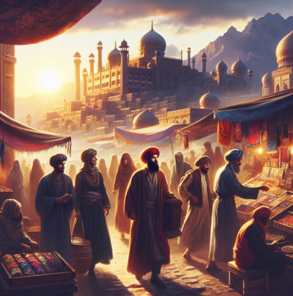

# **Mystic Ai: Dynamic Story Creator**
<a id="idtop"></a>  


## Table of Contents
* [Project Overview](#Project-Overview)
* [File Navigation](#File-Navigation)
* [Features](#Features)
* [How It Works](#How-It-Works)
* [Installation](#Installation)
* [Usage Instructions](#Usage-Instructions)
* [Demo and Slideshow](#Demo-and-Slideshow)
* [Application Development](#Application-Development)
* [Performance Optimization](#Performance-Optimization)
* [Additional Explanations and Major Findings](#Additional-Explanations-and-Major-Findings)
* [Additional Questions and Plan for future development](#Additional-Questions-and-Plan-for-future-development)
* [Conclusion](#Conclusion)
* [References](#References)
  

## Project Overview

## Mystic AI - Dynamic Story Creator

Mystic AI is a dynamic story experience using OpenAI's ChatGPT and DALL-E. Users can input a story genre or theme, and the app generates a dynamic story with accompanying images and user choices.

[🔼 Back to top](#idtop)
<hr>

## File Navigation
* Website
   -  [Resources/website](Resources/website) - Directory containing all of the website files used by the code
	-  `resources/website/app.py`: Entry point for the web application		
	-  `resources/website/llm_init.py`: OpenAI LLM initialization and prompt handling
	-  `resources/website/img_gen.py`: DALL-E 3 Image generation helper
	-  `resources/website/requirements.txt`: dependencies for the UI
	-  `resources/website/icons`: images for the UI

* Project
	-  [Resources/content](Resources/content) - Directory containing all of the image files used by the code
 	-  [Resources/data](Resources/data) - Directory containing all of the data files used by the code
 	-  [Resources/data](Resources/presentation) - Directory containing all of the presentation files used by the code 	
 	-  `README.md`: This documentation 

[🔼 Back to top](#idtop)
<hr>


## Features
1. **API Key Authentication**:
   - Users must provide their OpenAI API key to access the app's features.
   - The key is securely stored in the session state.
2. **Dynamic Story Generation**:
   - Stories are generated using OpenAI's ChatGPT based on the user's input genre or theme.
   - Each story section includes text, user choices, and an AI-generated image.
3. **AI-Generated Images**:
   - DALL-E generates images based on prompts extracted from the story.
4. **Interactive User Choices**:
   - Users can make choices at each story section, influencing the next part of the story.
5. **Session State Management**:
   - The app uses Streamlit's session state to manage user inputs, story sections, and app state.
6. **Sidebar Configuration**:
   - Includes instructions, API key input, and app information.

[🔼 Back to top](#idtop)
<hr>

## How It Works
1. **Setup**:
   - Users enter their OpenAI API key in the sidebar to authenticate.
   - They input a story genre or theme to begin.

2. **Story Generation**:
   - The app sends the user input to ChatGPT to generate a story.
   - Prompts for images are extracted and sent to DALL-E for image generation.

3. **Interactive Storytelling**:
   - Each story section is displayed with text, an image, and user choices.
   - User selections determine the next part of the story.

4. **Dynamic Updates**:
   - The app dynamically updates the story sections and maintains state across interactions.

[🔼 Back to top](#idtop)
<hr>

## Installation

1. Clone the repository:

```bash

git clone https://github.com/xraySMULu/project-3

```

2. cd resources/website/app.py

2. Install dependencies:

```bash

pip install -r requirements.txt

```

[🔼 Back to top](#idtop)
<hr>


## Usage Instructions
1. Run the main script:
	

```bash

streamlit run resources/website/app.py

```
2. Enter your OpenAI API key in the sidebar.
3. Input a story genre or theme in the main container.
4. Click "Begin story" to start generating the story.
5. Make choices at each story section to progress the story.
6. Enjoy the interactive storytelling experience!

[🔼 Back to top](#idtop)
<hr>


## Demo and Slideshow

**Mystic AI Demo**

* Navigate to [Demo](resources/content/ui_demo.gif)

**Mystic AI Slideshow**
* Navigate to [Slideshow PDF](resources/presentation/Mystic-AI.pdf)
* Navigate to [Slideshow Powerpoint](resources/presentation/Mystic-AI_pp.pptx)

**Mystic AI - DALL-E Prints**





[🔼 Back to top](#idtop)
<hr>


## Application Development

For the Mystic AI application, the application development steps involved preparing model prompt, user inputs, managing API responses, and ensuring the generated content is suitable for display. Below is an outline of the data and preprocessing steps:

1. **User Input Handling**:
   - **Input**: Users provide a story genre or theme and their OpenAI API key.
   - **Validation**: 
     - Ensure the API key starts with `sk-` to confirm it is valid.
     - Sanitize the genre input to remove unnecessary whitespace or invalid characters.
2. **API Key Authentication**:
   - Store the OpenAI API key securely in the session state.
   - Set the key as an environment variable for use in API calls.
3. **Language Model Response Processing**:
   - **Input**: User-provided genre or story continuation is sent to OpenAI's ChatGPT.
   - **Response Parsing**:
     - Split the response into lines and filter out empty lines or separators (e.g., `-- -- --`).
     - Identify and separate the story text, user choice labels, and options.
     - Ensure options are limited to a maximum of 6 for better user experience.
4. **Image Prompt Extraction**:
   - Extract the image prompt from the ChatGPT response (if present).
   - Remove any lines related to image generation from the story text.
5. **Image Generation**:
   - Use the extracted image prompt to generate an image with DALL-E.
   - Validate the generated image:
     - Ensure the image meets the minimum size requirement (e.g., 256x256 pixels).
     - Resize the image if necessary to meet display requirements.
6. **Session State Management**:
   - Store the processed story, user options, and generated image in the session state.
   - Maintain a list of story sections (`cols`) to dynamically render content.
7. **Dynamic Content Rendering**:
   - Use the processed data to display the story, user choices, and images in the app.
   - Ensure user interactions (e.g., radio button selections) are captured and processed to generate the next part of the story.
8. **Error Handling**:
   - Handle API errors (e.g., invalid API key, rate limits) gracefully by displaying appropriate warnings.
   - Provide fallback behavior if image generation fails (e.g., display text-only content).

[🔼 Back to top](#idtop)
<hr>

## Performance Optimization - 

### DALL-E 3 Image Model
**Information**
-
**Baseline Performance:**
- Prompt passed directly from GPT: Initially, the prompt was used as-is, directly from GPT without any modifications or cleanup. No cleanup: The DALLE prompt contained various formatting issues such as newline (\n) and carriage return (\r) characters, as well as unnecessary prefixes.
- Response Time Results
   - 
   - 

**Prompt Cleanup:**
   - Implemented DALLE prompt cleanup code: To enhance performance, we developed code that systematically cleans up the given DALLE prompt. This involves:
      - Removing newline (\n) and carriage return (\r) characters: These characters were eliminated to ensure the DALLE prompt is a single, continuous string.
      - Iteratively removing specific prefixes: The code removes a predefined set of prefixes that are often unnecessary and can clutter the prompt.
        ```bash

            prompt = prompt.replace("\n", " ").replace("\r", " ")
            for prefix in ["Prompt:", "Visual Prompt:", "Image Prompt:", "A.", "B.", "C.", "D.", "E.", "F.", "A)", "B)", "C)", "D)", "E)", "F)"]:
            prompt = prompt.replace(prefix, "")
        ``` 
      - This cleanup process results in a more streamlined and efficient DALLE prompt, which can be processed more effectively by the tool.
   - Simplifying prompt requests to DALL-E: To further optimize performance, we added a developer-recommended sentence that simplifies the prompt request. This sentence instructs the tool to use the DALLE prompt as-is without adding any additional details. The sentence is:
   ```bash

      "I NEED to test how the tool works with extremely simple prompts. DO NOT add any detail, just use it AS-IS:" + prompt
   ``` 
   - By including this sentence, we ensure that the tool processes the prompt in its simplest form, which can lead to more accurate and faster results.
   - Response Time Results
      - 
      - 
      - 
      - 

**Performance Results**
- Baseline Response Time: 14.84 seconds
- Post-Modification Response Time: 9.73 seconds
- Improvement: 34.43%


## Additional Explanations and Major Findings

### Additional Explanations

1. **AI Integration**: Mystic AI combines OpenAI's ChatGPT for natural language processing and storytelling with DALL-E for generating visually appealing images. This integration demonstrates how AI can work cohesively to create an immersive user experience.
2. **User Interactivity**: The application allows users to actively participate in the storytelling process by selecting themes and making choices that influence the narrative. This interactivity highlights the potential of AI to create personalized and engaging content.
3. **Session State Management**: By leveraging Streamlit's session state, the app ensures a seamless user experience, maintaining story progression and user inputs across interactions without requiring page reloads.
4. **Error Handling**: The app includes mechanisms to handle potential API errors gracefully, ensuring reliability and usability.


[🔼 Back to top](#idtop)
<hr>


### Major Findings

1. **Challenges in GPT Response**: Chat-GPT struggled at times returning storyline options but demonstrated that it can generate coherent, engaging, and contextually relevant stories, showcasing its potential in creative industries.
2. **Seamless Integration**: The combination of ChatGPT and DALL-E highlights the effectiveness of integrating multiple AI models to deliver a unified experience.
3. **Importance of GPT Cleanup**: Properly parsing and cleaning AI-generated responses is critical to ensuring the content is user-friendly and visually appealing.
4. **Challenges in Image Generation**: While DALL-E generates impressive visuals, priorities included ensuring the images meet size and quality requirements as well as addressing slow load times from malformed prompts.
5. **Scalability and Adaptability**: The app's modular architecture allows for easy expansion, making it adaptable for various use cases, such as education, entertainment, or creative writing tools.

[🔼 Back to top](#idtop)
<hr>


## Additional Questions and Plan for future development

### Additional Questions

1.  **How can we improve the coherence of AI-generated stories?**    
    - While ChatGPT generates engaging narratives, ensuring logical consistency across multiple story sections remains a challenge. How can we refine prompts or use memory mechanisms to improve this?
2.  **What are the limits of user interactivity?**    
    - How many choices or branching paths can we realistically support before the complexity becomes unmanageable for both the user and the application?
3.  **How can we optimize image generation?**    
    - DALL-E occasionally produces images that do not align perfectly with the story context. How can we improve prompt engineering or incorporate user feedback to refine image generation?
4.  **What additional features would enhance user engagement?**    
    - Would features like saving stories, sharing them, or adding sound effects/music improve the overall experience?
5.  **How scalable is the application?**    
    - As more users interact with the app, how can we ensure that API rate limits, server performance, and caching mechanisms can handle increased demand?

[🔼 Back to top](#idtop)
<hr>


### Plan for Future Development

1.  **Enhance Story Coherence**:    
    -   Implement memory mechanisms or context-passing techniques to ensure consistency across story sections.
    -   Explore fine-tuning ChatGPT with custom datasets for more domain-specific storytelling.
2.  **Expand User Interactivity**:    
    -   Add support for more complex branching narratives and user-defined story elements.
    -   Introduce a "sandbox mode" where users can directly edit or guide the story.
3.  **Improve Image Generation**:    
    -   Develop better prompt engineering techniques for DALL-E to align visuals more closely with the story.
    -   Allow users to provide feedback on generated images and regenerate them if needed.
4.  **Introduce Story Saving and Sharing**:    
    -   Enable users to save their stories locally or in the cloud.
    -   Add options to share stories on social media or export them as PDFs.
5.  **Optimize Performance**:    
    -   Implement caching mechanisms for frequently used API calls to reduce latency.
    -   Explore server-side deployment options to handle higher user loads.
6.  **Incorporate Additional AI Models**:    
    -   Experiment with other AI models for storytelling or image generation, such as Stable Diffusion or GPT-4.
    -   Add support for voice synthesis to narrate the story.
7.  **Expand Use Cases**:    
    -   Adapt the application for educational purposes, such as teaching creative writing or history through interactive stories.
    -   Explore gamification elements to make the experience more engaging.
8.  **User Feedback Integration**:    
    -   Collect user feedback to identify pain points and prioritize new features.
    -   Conduct usability testing to refine the interface and improve the overall experience.

By addressing these questions and implementing these plans, Mystic AI can evolve into a more robust, scalable, and engaging platform that continues to push the boundaries of AI-driven storytelling.

[🔼 Back to top](#idtop)
<hr>


## Conclusion

Mystic AI revolutionizes storytelling by using AI to create dynamic and visually stunning narratives. Combining ChatGPT for engaging stories and DALL-E for captivating images, it offers a unique platform for creativity and imagination.

This application enhances storytelling, making it more interactive and visually appealing. Mystic AI showcases AI's potential in creative domains, inspiring innovation and redefining how stories are told.

[🔼 Back to top](#idtop)
<hr>


## References

- [LangChain Documentation](https://python.langchain.com/)

- [OpenAI API](https://platform.openai.com/docs/)

- [DALL-E 3 API](https://help.openai.com/en/articles/8555480-dall-e-3-api)

[🔼 Back to top](#idtop)
<hr>
