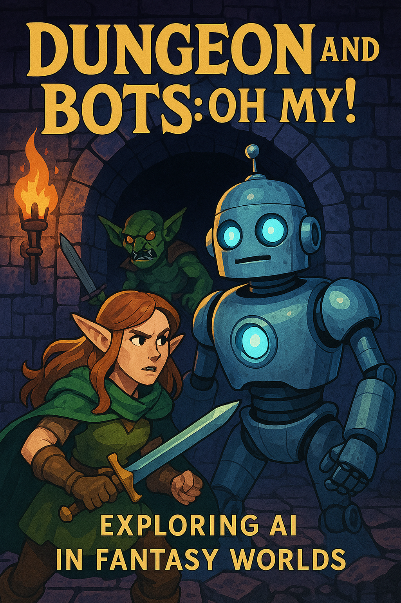

# **Project 3 Team 2 - Dungeon and Bots: Oh My! - Exploring AI in Fantasy Worlds**
* The Battle


# AI Story Parser & Choose Your Adventure Generator

## Project Overview
This project is an AI-powered tool designed to parse a story and generate a dynamic "Choose Your Adventure" experience. By leveraging Large Language Models (LLMs), the tool enables users to input a story, which is then processed to create an interactive branching narrative. 

## Package Requirements
Ensure you have the following dependencies installed:
```bash
pip install langchain openai pinecone-client langchain-pinecone langchain-openai python-dotenv pypdf
```

## File Navigation
- `main.py`: Entry point for the application
- `parser.py`: Handles text parsing from PDFs
- `generator.py`: Uses LLM to create branching story paths
- `config.env`: Environment variables for API keys
- `README.md`: This documentation

## Installation
1. Clone the repository:
   ```bash
   git clone https://github.com/your-repo/ai-adventure.git
   cd ai-adventure
   ```
2. Install dependencies:
   ```bash
   pip install -r requirements.txt
   ```
3. Set up environment variables in a `.env` file:
   ```
   OPENAI_API_KEY=your_openai_api_key
   PINECONE_API_KEY=your_pinecone_api_key
   ```

## Usage
1. Run the main script:
   ```bash
   python main.py
   ```
2. Upload a story in text or PDF format.
3. The AI will parse the story and generate branching choices for an interactive experience.
4. View or export the generated adventure.

## Demo & Slideshow
Screenshots and walkthrough videos can be found in the `docs/demo` folder.

## Purpose of Use
The tool is designed for:
- Interactive storytelling
- Educational purposes
- AI-assisted narrative generation

## Data Pre-processing and Gathering Steps
- Extract text from a provided PDF or text file
- Segment the story into logical scenes
- Identify choice points and generate alternatives

## Visuals and Explanations
- Flowcharts depicting the branching logic
- Screenshots of the generated story paths

## Additional Explanations and Major Findings
- The model effectively creates diverse branching paths
- Some limitations in complex story logic may require human refinement

## Additional Questions That Surfaced and Plan for Future Development
- How can we improve character consistency in AI-generated choices?
- Can we integrate a UI for better user interaction?
- Future updates may include support for voice input and game export options

## Conclusion and References
This project demonstrates the power of AI in transforming static stories into interactive experiences. 

### References
- [LangChain Documentation](https://python.langchain.com/)
- [OpenAI API](https://platform.openai.com/docs/)
- [Pinecone Documentation](https://www.pinecone.io/)
